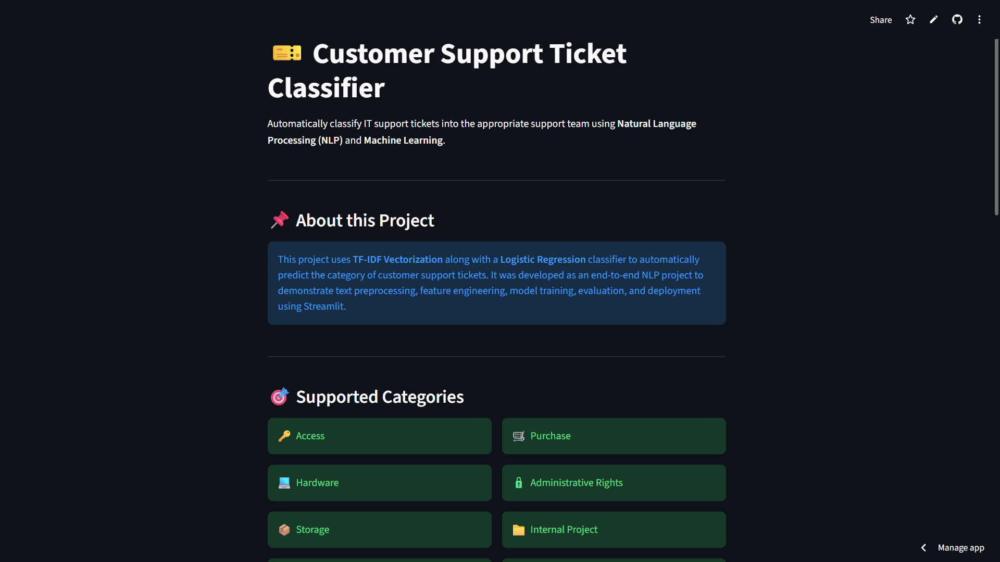
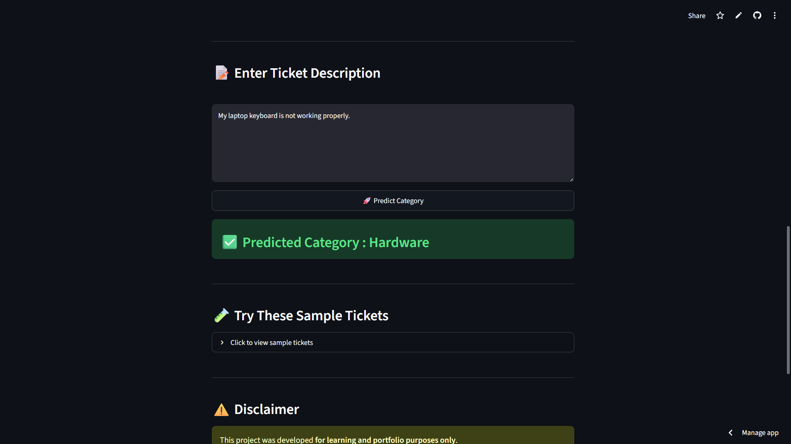

# 🎫 Customer Support Ticket Classification using NLP


An end-to-end **Natural Language Processing (NLP)** project that automatically classifies customer support tickets into the appropriate support topic group using **TF-IDF Vectorization** and **Logistic Regression**.

The project demonstrates the complete Machine Learning workflow including **data exploration, text preprocessing, feature engineering, baseline modeling, preprocessing experiments, error analysis, model comparison, model deployment, and Streamlit integration.**

---

# 🚀 Live Demo

> **Streamlit App:** https://customer-support-ticket-classification-nlp.streamlit.app/

> **GitHub Repository:** https://github.com/amandeep-singh28/Smart-Customer-Support-Ticket-Router---NLP

---

# 📸 Application Screenshots

## 🏠 Home Page



---

## 🎯 Prediction Example



---

# 📑 Table of Contents

- Project Objective
- Tech Stack
- Supported Topic Groups
- Dataset
- Project Structure
- Project Pipeline
- Methodology
- Model Comparison
- Final Model
- Final Results
- Streamlit Application
- Installation
- Important Files
- Limitations
- Future Improvements
- Conclusion
- Author

---

# 🎯 Project Objective

Customer support teams receive thousands of text-based support tickets every day. Manually reading and routing these tickets to the correct department is slow, repetitive, and error-prone.

This project builds an NLP-based ticket classification system capable of reading a ticket description and automatically predicting the most appropriate **Topic Group**.

The final application is deployed using **Streamlit**, allowing users to classify tickets through a simple web interface.

---

# 🛠 Tech Stack

- Python
- Pandas
- NumPy
- Scikit-learn
- TF-IDF Vectorizer
- Logistic Regression
- Joblib
- Streamlit
- Matplotlib
- Seaborn

---

# 🎯 Supported Topic Groups

The model predicts the following **8 support categories**.

| Topic Group | Description |
| ------------ | ----------- |
| 🔑 Access | Login, password, permissions, VPN and account related issues |
| 🔒 Administrative Rights | Administrator privilege requests |
| 💻 Hardware | Laptop, desktop, printer, scanner and device issues |
| 👨‍💼 HR Support | Employee onboarding and HR-related requests |
| 📁 Internal Project | Internal project support requests |
| 📄 Miscellaneous | General tickets not belonging to a specific category |
| 🛒 Purchase | Equipment, purchase order and license requests |
| 📦 Storage | Mailbox, storage, drive and shared folder issues |

---

# 📂 Dataset

The processed dataset is available at:

```text
Dataset/all_tickets_processed_improved_v3.csv
```

### Dataset Summary

| Detail | Value |
|---------|------:|
| Total Records | 47,837 |
| Features | Document, Topic_group |
| Number of Classes | 8 |

### Class Distribution

| Topic Group | Records |
|--------------|-------:|
| Hardware | 13,617 |
| HR Support | 10,915 |
| Access | 7,125 |
| Miscellaneous | 7,060 |
| Storage | 2,777 |
| Purchase | 2,464 |
| Internal Project | 2,119 |
| Administrative Rights | 1,760 |

The dataset is imbalanced; therefore **weighted evaluation metrics** were used during model evaluation.

---

# 📁 Project Structure

```text
Customer Support Ticket Classification NLP/

│── app.py
│── README.md
│── Observations.txt
│── Smart_IT_Support_Ticket_Classifier_Project_Plan_Updated.pdf
│
├── Dataset/
│   └── all_tickets_processed_improved_v3.csv
│
├── Models/
│   ├── logistic_model.pkl
│   └── tfidf_vectorizer.pkl
│
├── Notebooks/
│   ├── 01.ipynb
│   ├── 02.ipynb
│   ├── 03_BaselineModel.ipynb
│   ├── 04_ErrorAnalysis.ipynb
│   ├── 05_TextPreprocessing.ipynb
│   ├── 06_ModelComparison.ipynb
│   ├── 07_FinalModel.ipynb
│   ├── baselineResults.csv
│   └── data.csv
│
└── Comparison/
    └── Comparison.docx
```

---

# 🔄 Project Pipeline

```text
Raw Dataset
      │
      ▼
Data Exploration
      │
      ▼
Text Understanding
      │
      ▼
TF-IDF Vectorization
      │
      ▼
Baseline Model
      │
      ▼
Error Analysis
      │
      ▼
Text Preprocessing Experiments
      │
      ▼
Model Comparison
      │
      ▼
Final Model Selection
      │
      ▼
Model Serialization
      │
      ▼
Streamlit Deployment
```

---

# 🧠 Methodology

## 1️⃣ Data Understanding

The ticket text is stored in the **Document** column while **Topic_group** represents the target label.

Exploration revealed many conversational email words such as:

```text
dear
hello
thanks
regards
please
good morning
```

These words appear frequently but provide very little information for ticket classification.

---

## 2️⃣ Baseline Model

The first baseline model used the following pipeline:

```text
Document
      │
      ▼
TF-IDF Vectorizer
      │
      ▼
Logistic Regression
```

The baseline already achieved strong performance because TF-IDF naturally reduces the importance of highly frequent words while emphasizing informative technical terms.

---

## 3️⃣ Text Preprocessing Experiments

Multiple preprocessing experiments were conducted.

The following operations were tested:

- Lowercase conversion
- Punctuation removal
- Number removal
- English stopword removal
- Custom stopword removal

Although the text became cleaner, the overall model performance remained almost unchanged.

**Final Decision:** Use the original document representation because TF-IDF already handled common words effectively.

---

## 4️⃣ Error Analysis

Prediction results were exported to

```text
Notebooks/baselineResults.csv
```

Each incorrect prediction was manually inspected to understand model weaknesses.

The most challenging class was **Administrative Rights** due to fewer training examples and overlap with Access and HR Support.

---

# 📊 Model Comparison

Several Machine Learning algorithms were evaluated using identical TF-IDF features.

| Model | Accuracy | Precision | Recall | F1 Score |
|--------|---------:|----------:|--------:|---------:|
| Logistic Regression | **85.82%** | **86.26%** | **85.82%** | **85.83%** |
| Linear SVM | 85.61% | 85.73% | 85.61% | 85.62% |
| Random Forest | 83.09% | 84.21% | 83.09% | 83.05% |
| Multinomial Naive Bayes | 73.76% | 78.12% | 73.76% | 72.60% |

### 🏆 Selected Model

**Logistic Regression** was selected because it achieved the highest overall performance while remaining simple, interpretable, and highly effective for sparse TF-IDF features.

---

# 🤖 Final Model

Saved Model:

```text
Models/logistic_model.pkl
```

Saved TF-IDF Vectorizer:

```text
Models/tfidf_vectorizer.pkl
```

Final prediction pipeline:

```text
Ticket Description
        │
        ▼
TF-IDF Vectorizer
        │
        ▼
Logistic Regression
        │
        ▼
Predicted Topic Group
```

---

# 📈 Final Results

| Metric | Score |
|---------|------:|
| Accuracy | **85.82%** |
| Weighted F1 Score | **85.83%** |

### Observations

- Purchase, Storage and Access achieved strong performance.
- Administrative Rights remains the most challenging class.
- Hardware and Miscellaneous occasionally overlap because of similar ticket wording.

---

# 📸 Application Screenshots

## Home Page

*(Add Screenshot Here)*

---

## Prediction Example

*(Add Screenshot Here)*

---

# 🌐 Streamlit Application

The project includes an interactive Streamlit application.

Run locally using:

```bash
streamlit run app.py
```

The application:

- Accepts ticket descriptions
- Predicts the support topic group
- Displays supported categories
- Shows model information
- Includes verified sample tickets
- Explains project limitations

---

# ⚙️ Installation

Clone the repository

```bash
git clone https://github.com/amandeep-singh28/Smart-Customer-Support-Ticket-Router---NLP.git
```

Move into the project directory

```bash
cd Smart-Customer-Support-Ticket-Router---NLP
```

Install dependencies

```bash
pip install -r requirements.txt
```

Run the Streamlit application

```bash
streamlit run app.py
```

---

# 📄 Important Files

| File | Description |
|------|-------------|
| Observations.txt | Experimental observations |
| 03_BaselineModel.ipynb | Baseline TF-IDF model |
| 04_ErrorAnalysis.ipynb | Error Analysis |
| 05_TextPreprocessing.ipynb | Preprocessing Experiments |
| 06_ModelComparison.ipynb | Model Comparison |
| 07_FinalModel.ipynb | Final Model |
| logistic_model.pkl | Trained classifier |
| tfidf_vectorizer.pkl | Saved TF-IDF Vectorizer |
| app.py | Streamlit Application |

---

# ⚠️ Limitations

This project was developed for **learning and portfolio purposes**.

The model may produce incorrect predictions when:

- The ticket is extremely short.
- The issue belongs to multiple categories.
- The wording differs significantly from the training data.
- The ticket belongs to a minority class.
- The issue is ambiguous.

Predictions should be treated as **decision support**, not final business decisions.

---

# 🚀 Future Improvements

- Improve minority class performance
- Hyperparameter tuning
- Class balancing techniques
- Compare with transformer-based models (BERT)
- Display prediction confidence
- Show Top-3 predicted categories
- Enhance Streamlit UI

---

# ✅ Conclusion

This project demonstrates that a well-designed traditional NLP pipeline using **TF-IDF** and **Logistic Regression** can effectively solve multi-class customer support ticket classification.

The project covers the complete Machine Learning lifecycle—from dataset understanding and experimentation to deployment—making it a practical end-to-end NLP portfolio project.

---

# 👨‍💻 Author

**Amandeep Singh**

B.Tech Computer Science & Engineering

Lovely Professional University

GitHub: https://github.com/amandeep-singh28

---

# 📄 License

This project is intended for educational, learning, and portfolio purposes.